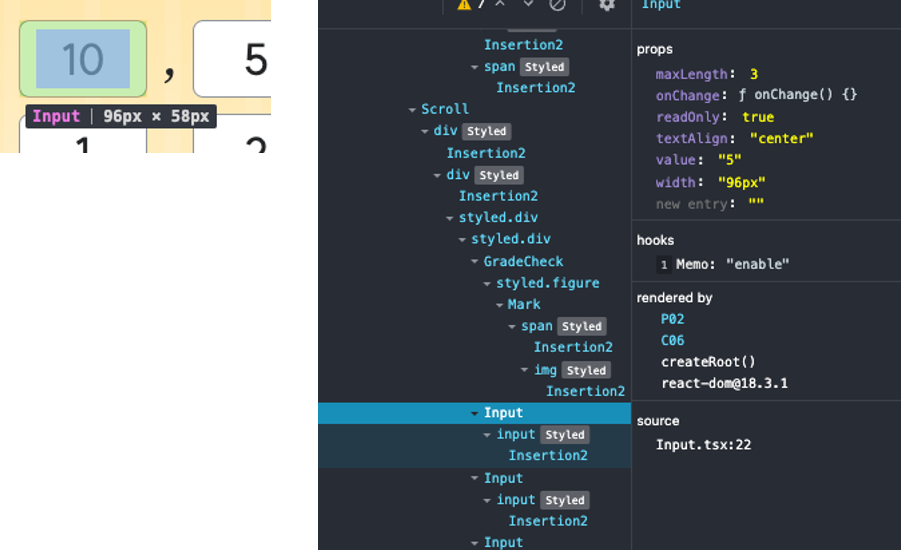

# 리액트의 제어 컴포넌트

### 들어가며

프로젝트를 하며 페이지 이동시 value 값이 변하지 않는 이슈를 마주했다.

처음에는 렌더링 이슈로 value가 변하지 않나 했지만, react-dev-tool로 찍어본 value는 제대로 바뀌어 있었다.



그렇다면 과연 무엇이 문제였을까?

공통 컴포넌트였던 `<Input />`의 코드를 까보자 다음과 같은 형태로 코드가 작성되어있었다.

```ts
const Input = ({...otherProps, value}) => {
  ...

  return (
    <input
      defaultValue = {defaultValue || value}
    />
  )
}
```

해당 코드는 협력사가 작성해놓았던 공통 컴포넌트로, 바로 `value={value}` 옵션을 넣어달라고 요청해 금방 해결되었다.

하지만 이 과정에서 제어 컴포넌트(controlled component)와 비제어 컴포넌트(uncontrolled component)에 대해 학습하게 되었고, 학습한 내용을 바탕으로 간략한 내용을 정리해보고자 한다.

---

### 제어 컴포넌트, 그게 뭔데?

아마 프론트엔드 개발자가 가장 빈번히 마주하는 페이지 중 하나는 form 일 것이다.

form 안에는 주로 `<input>`, `<textarea>`, `<select>` elements를 갖는다.

해당 element에 접근할 때, React에 의해 직접 값이 제어되는 컴포넌트를 제어 컴포넌트라고 한다.

```ts
// example

const ControlledComponent = () => {
  const [inputValue, setInputValue] = useState('');

  const handleChange = (event) => {
    setInputValue(event.target.value);
  };

  const handleSubmit = (event) => {
    event.preventDefault();
    console.log('Submitted value:', inputValue);
  };

  return (
    <form onSubmit={handleSubmit}>
      <label>
        Input:
        <input type="text" value={inputValue} onChange={handleChange} />
      </label>
      <button type="submit">Submit</button>
    </form>
  );
};
```

흔히 React를 활용해 form을 만들고 input의 value을 state로 관리하는 방식이 제어 컴포넌트 방식이다.

이처럼 input value attribute를 react에서 state로 관리하게 되는데, 이를 <strong>신뢰 가능한 단일 출처</strong> 라고 한다.

---

### 신뢰 가능한 단일 출처(single source of truth)

> 신뢰 가능한 단일 출처란 하나의 상태는 한 곳에만 존재해야함을 말한다.

React에서 Form Element를 다루다보면 DOM 자체에서 상태를 들고 있게되는 경우가 있다.

예를 들어, input 태그는 사용자가 입력한 값을 DOM 자체에서 value attribute로 담고 있다.

여기서 제어 컴포넌트는 input 태그의 value attribute 상태를 React의 상태로 만들어 관리하고, 비제어 컴포넌트는 전통적인 방식인 DOM 자체에서 상태를 관리한다.

React의 상태로 만들어서 관리하면 React에서 Form에서 발생하는 사용자의 입력 값을 제어하므로 해당 상태가 신뢰 가능함을 React를 통해 보장받을 수 있게 된다.

---

### 비제어 컴포넌트란?

그렇다면 흔히 사용하던 React의 제어 컴포넌트가 아닌, 비제어 컴포넌트란 무엇일까?

React가 값을 보장하지 않는 방식을 말한다.

> 즉, ref를 이용해 DOM에 선언된 Element에 직접 접근한 뒤 해당 값을 관리하는 방식이다.

```ts
// example

const UncontrolledComponent = () => {
    const inputRef = useRef(null);

    return (
      <input ref={inputRef} />
    )
}
```

state로 관리하지 않기 때문에 state가 변경되어도 재렌더링이 되지 않지만, 정보의 동기화(실시간성)를 보장받지 못한다.

하지만 비제어 컴포넌트에도 장점이 있다.

- 간단한 초기화와 기본 값 설정

```ts
<input type="text" defaultValue="Initial Value" />
```

- Form data 수집의 단순화

- 불필요한 리렌더링이 없어 성능 개선 가능

---

### 언제, 무엇을 써야할까?

물론 대부분의 경우, React가 상태를 보장하는 제어 컴포넌트를 사용하는 것이 유리하다.

하지만 앞서 말한 제어 컴포넌트, 그리고 비제어 컴포넌트의 장단점을 따져가며 자신의 상황에 맞는 입력 방식을 사용하도록 하자.

추가적으로, 기회가 되면 react-hook-form에서 마주했던 다양한 form 관련 이슈들과 관련한 글을 작성해보겠다.

> <strong>제어 컴포넌트 (Controlled Components)</strong>

| 특징                      | 설명                                                           |
| ------------------------- | -------------------------------------------------------------- |
| **상태 관리**             | 입력 값이 리액트 컴포넌트의 state에 의해 관리됨                |
| **값 변경 처리**          | `onChange` 이벤트 핸들러를 통해 state가 업데이트됨             |
| **신뢰 가능한 단일 출처** | 데이터의 출처가 리액트 state로 통일되어 데이터 일관성이 보장됨 |
| **초기 값 설정**          | state의 초기 값을 설정하여 관리                                |
| **데이터 흐름**           | 단방향 데이터 흐름을 유지하여 디버깅과 테스트가 용이함         |

| 장점                        | 설명                                                         |
| --------------------------- | ------------------------------------------------------------ |
| **데이터 일관성 보장**      | 모든 입력 값이 컴포넌트의 state로 관리되므로 일관성이 유지됨 |
| **입력 값 검증 용이**       | 입력 값의 검증 및 변환 로직을 쉽게 구현할 수 있음            |
| **동적 폼 처리**            | 복잡한 폼 처리 로직을 쉽게 구현 가능                         |
| **단방향 데이터 흐름 유지** | 데이터 흐름이 예측 가능하고 디버깅이 쉬움                    |

| 단점                 | 설명                                                                                |
| -------------------- | ----------------------------------------------------------------------------------- |
| **코드 복잡성 증가** | 모든 입력 필드를 state로 관리해야 하므로 코드가 복잡해질 수 있음                    |
| **성능 저하 가능성** | 입력 값이 많을 경우, 모든 입력 변화에 대해 state 업데이트가 발생하여 성능 저하 가능 |

<br>

> <strong>비제어 컴포넌트 (Uncontrolled Components)</strong>

| 특징                           | 설명                                                              |
| ------------------------------ | ----------------------------------------------------------------- |
| **상태 관리**                  | 입력 값이 DOM에서 직접 관리됨                                     |
| **값 변경 처리**               | `ref`를 통해 DOM 요소에 접근하여 값을 가져오거나 설정             |
| **신뢰 가능한 단일 출처 부재** | 입력 값이 컴포넌트의 state와 분리되어 관리되므로 단일 출처가 아님 |
| **초기 값 설정**               | `defaultValue` 속성을 사용하여 초기 값을 설정                     |
| **데이터 흐름**                | 데이터가 여러 출처에서 관리되어 데이터 흐름이 복잡해질 수 있음    |

| 장점                            | 설명                                                                           |
| ------------------------------- | ------------------------------------------------------------------------------ |
| **코드 단순화**                 | 간단한 폼 데이터 처리에 유리하고 코드가 간단해짐                               |
| **성능 이점**                   | 입력 변화에 대해 state 업데이트가 발생하지 않으므로 성능 저하를 방지할 수 있음 |
| **기존 코드와 통합 용이**       | 기존의 비제어 폼과 쉽게 통합할 수 있음                                         |
| **빠른 초기화 및 기본 값 설정** | `defaultValue`를 통해 간단히 초기 값을 설정 가능                               |

| 단점                        | 설명                                                             |
| --------------------------- | ---------------------------------------------------------------- |
| **데이터 일관성 문제**      | 입력 값이 DOM과 리액트 state로 분리되어 일관성을 유지하기 어려움 |
| **유지보수 어려움**         | 데이터의 출처가 여러 곳에 분산되어 값의 변경 추적이 어려움       |
| **복잡한 폼 처리에 부적합** | 복잡한 입력 값 검증 및 변환 로직 구현이 어려움                   |
| **단방향 데이터 흐름 부재** | 데이터 흐름이 예측 가능하지 않아서 디버깅이 어려울 수 있음       |
