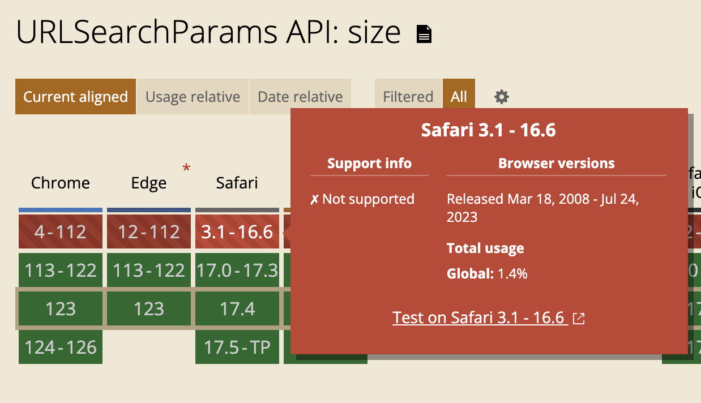

# FE개발자는 웹 브라우저를 어떻게 대해야 하는가

## 배포 괴담

때는 정기 배포를 하고 몇 시간 뒤... iOS 환경에서 최근에 추가한 어떠한 동작이 실행되지 않는 다는 소식이 들려왔다. 부리나케 확인해보니 Safari 브라우저에서 URLSearchParams의 size property가 없어서 발생한 이슈였다.
query string이 존재할 때만 특정 기능을 실행하고 싶었고, URLSearchParams API는 Map과 같은 형태라 size property를 사용하면 되겠다고 생각했다. 그런데 Safari 브라우저에서는 size property가 없어서 이슈가 발생한 것이다.

```typescript
const params = new URLSearchParams(window.location.search);
console.log(params.size); // Uncaught TypeError: Cannot read property 'size' of undefined
```

결국, query string이 있는지 판단하는 로직은 다른 방법으로 대체하였고, 이슈는 해결되었다. 하지만 이 사건을 통해 브라우저 지원여부를 확인하는 습관을 들여야겠다고 생각했다.
오늘은 이번 사건을 통해 느낀점을 이야기해보려고 한다.

### Can I Use?

[Can I Use?](https://caniuse.com/?search=URLSearchParams.size) 는 브라우저 지원에 대한 정보를 제공하는 웹사이트이다. 웹 개발자와 브라우저 지원을 확인하는 데 유용하다. 사이트를 사용하면 특정 기능이 특정 브라우저에서 지원되는지 여부를 확인할 수 있다.



### IDE 자동완성을 너무 신뢰하지 마시오

IDE의 자동완성은 때론 너무 **'앞서나갈'** 수 있다. 최신 문법을 사용하면서 브라우저 지원여부를 확인하지 않는다면, 이런 문제가 발생할 수 있다. 브라우저 지원여부를 확인하지 않고, IDE의 자동완성을 너무 신뢰하면 안된다.

위 경우에도 그렇다. [URLSearchParams 관련 MDN 문서](https://developer.mozilla.org/en-US/docs/Web/API/URLSearchParams)를 보면 size property가 있다고 나와있고, IDE에서도 자동완성이 되었다. 하지만 Safari 브라우저에서는 size property가 없었다. 이런 경우가 발생할 수 있기 때문에, 평소 잘 사용하지 않는 브라우저 API를 사용한다 싶으면 IDE 자동완성을 맹신하지 말고 Can I Use?를 통해 브라우저 지원여부를 확인할 필요가 있다.

더 확장하여 생각해보자면, 내 개발환경에서의 실행이 유저 환경을 담보하지는 않는다는 것을 느꼈다. 만약 유저가 최신 문법이 적용되어있지 않은 브라우저를 사용한다면? 이런 경우를 대비하여, 브라우저 지원여부를 확인하고, 그에 따른 대응을 해야한다.

**DOM API**

> W3C DOM, WHATWG DOM 표준은 대부분의 브라우저에서 DOM 을 구현하는 기준이다. 많은 브라우저들이 표준 규약에서 제공하는 기능 외에도 추가적인 기능들을 제공하기 때문에 사용자가 작성한 문서들이 각기 다른 DOM 이 적용된 다양한 브라우저 환경에서 동작할 수 있다는 사실을 항상 인지하고 있어야 한다.


질문

- 유저에게 버전 업데이트를 강요할 수 있는가?
- 유저에게 버전 업데이트를 강요할 수 없다면, 어떻게 문제를 해결해야하는가?
