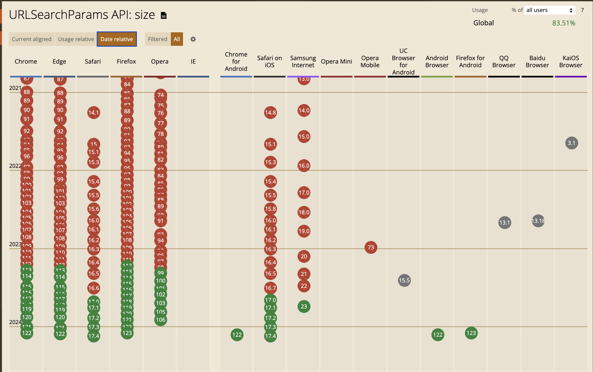

# FE개발자는 웹 브라우저를 어떻게 대해야 하는가

## Preview

safari에서 URLSearchParams의 size property가 없어 이슈가 발생한 일화

말하고자 하는 포인트

- IDE의 자동완성은 때론 너무 **'앞서나갈'** 수 있다.
  - URLSearchParams.size 추천
- MDN 문서를 보면 size property가 있다고 나와있음
  - [URLSearchParams 관련 MDN 문서](https://developer.mozilla.org/en-US/docs/Web/API/URLSearchParams)
- 내 개발환경에서의 실행이 유저 환경을 담보하지는 않는다.
  - 만약 유저가 최신 문법이 적용되어있지 않은 브라우저를 사용한다면?
- 브라우저의 지원여부를 확인하는 습관을 들여야 한다.
  - can i use, MDN, W3C 등의 문서를 참고하여 브라우저 지원여부를 확인하자.
  - 
- DOM API
  > W3C DOM, WHATWG DOM 표준은 대부분의 브라우저에서 DOM 을 구현하는 기준이다. 많은 브라우저들이 표준 규약에서 제공하는 기능 외에도 추가적인 기능들을 제공하기 때문에 사용자가 작성한 문서들이 각기 다른 DOM 이 적용된 다양한 브라우저 환경에서 동작할 수 있다는 사실을 항상 인지하고 있어야 한다.

질문

- 유저에게 버전 업데이트를 강요할 수 있는가?
- 유저에게 버전 업데이트를 강요할 수 없다면, 어떻게 문제를 해결해야하는가?
